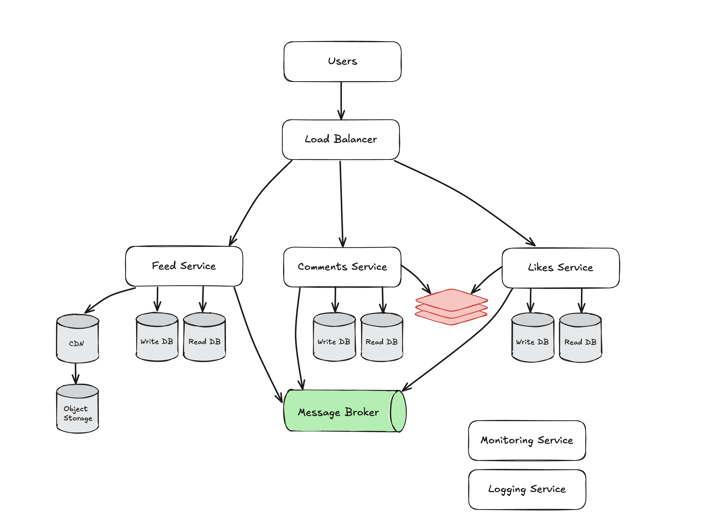

# hsa13-hw6-high-load-app-architecture

I chose a microservices-based architecture with event-driven communication to handle scalability, fault tolerance, and modularity efficiently.

### **Core Components:**
1. **Users**  
   - Users access the system through a web or mobile client.

2. **Load Balancer/API Gateway**  
   - Routes requests to the appropriate services (Feed, Likes, Comments).  
   - Ensures API rate limiting and authentication.

3. **Feed Service**  
   - Manages the user's news feed (photos/videos).  
   - Writes new posts to **Feed Write DB** and reads from **Feed Read DB**.  
   - Uses **Cache** for frequently accessed feeds.  
   - Publishes new posts to **Message Broker**.

4. **Likes Service**  
   - Handles like operations (add/remove/count).  
   - Writes to **Likes Write DB**, reads from **Likes Read DB**.  
   - Uses **Cache** for frequently accessed like counts.  
   - Publishes like events to **Message Broker**.

5. **Comments Service**  
   - Manages adding, editing, and fetching comments.  
   - Writes to **Comments Write DB**, reads from **Comments Read DB**.  
   - Uses **Cache** for popular comments.  
   - Publishes comment events to **Message Broker**.

6. **Databases:**  
   - Each service has **separate databases for write and read operations** to optimize performance:  
     - **Feed Write DB / Feed Read DB**  
     - **Likes Write DB / Likes Read DB**  
     - **Comments Write DB / Comments Read DB**  
   - Uses **replication and sharding** for scalability.

7. **Cache**  
   - A distributed cache speeds up read-heavy operations.

8. **Message Broker**  
   - Enables **event-driven communication** (e.g., new likes, new comments).  
   - Ensures **asynchronous event processing** to prevent blocking requests.

9. **CDN**  
   - **Serves images/videos** from cache instead of backend storage.  
   - Reduces **latency** by delivering media from edge locations.  
   - **If cache miss:** fetches data from **Object Storage**.

10. **Object Storage for Media**  
    - The **source of truth** for all media files.  
    - Used when the **CDN does not have a cached copy**.

11. **Monitoring Service:**  
    - Tracks metrics like latency, throughput, and error rates for all services and components.

12. **Logging Service:**  
    - Centralized logging for analyzing service behavior and debugging issues.

## Bottlenecks and Solutions

### 1. Database Overload  
- A **single database** cannot handle a **10x increase** in read/write traffic.  
**Solution:**  
   - Use **separate read/write databases**.  
   - Enable **replication and sharding** for scalability.

### 2. Service Overload  
- Increased requests may **slow down services** or cause failures.  
**Solution:**  
   - **Scale services horizontally** by adding more instances.  
   - Use **load balancing** to distribute traffic.

### 3. Message Broker Overload  
- The broker could **become a bottleneck** if not scaled.  
**Solution:**  
   - Use a **clustered message broker** with **partitioning**.  
   - Optimize **queue handling** for high throughput.

### 4. API Gateway as SPOF  
- A **single API Gateway failure** stops all traffic.  
**Solution:**  
   - Deploy **multiple API Gateway instances** with **automatic failover**.  
   - Use **load balancers** for redundancy.

### 5. Media Storage Latency  
- Serving **images/videos** from backend storage is slow.  
**Solution:**  
   - Use a **CDN** to cache and serve media closer to users.  
   - Store all original media in **Object Storage (e.g., AWS S3, Google Cloud Storage)**.

## Benefits of this Architecture

- **Scalability:** Microservices, separate read/write databases, and CDN allow for independent scaling.
- **Performance:** Caching (both **CDN and Redis**) significantly reduces latency.
- **Fault Tolerance:** Redundant instances of API Gateway, databases, and message broker ensure high availability.
- **Flexibility:** Decoupled services make it easy to update and deploy individual components.
